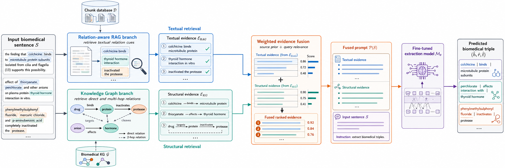

# BioHybridKG: A Hybrid Knowledge Graph and Retrieval-Augmented Generation Framework for Biomedical Relation Triple Extraction

**BioHybridKG** (also referred to as **HybridRKG**) is an academic research thesis project that introduces a hybrid framework designed to extract high-accuracy relation triples (`subject|RELATION|object`) from unstructured biomedical literature. By synergizing the structural precision of **Knowledge Graphs (KGs)** with the semantic contextualization of **Retrieval-Augmented Generation (RAG)**, BioHybridKG addresses the limitations of hallucination and context omission in traditional Large Language Models (LLMs) applied to the biomedical domain.

### 📍 Main Pipeline


### 🔬 Thesis Abstract & Methodology
Biomedical relation extraction is a crucial task for building structured clinical databases, discovering drug-drug interactions, and understanding gene-disease pathways. However, pure RAG-based systems suffer from noisy text retrieval, while pure KG-based systems lack the contextual understanding of textual discourse. 

BioHybridKG solves this by implementing a dual-pathway architecture:
1. **Structured KG Path (Direct Evidence):** Compiles dataset facts into a graph structure (using NetworkX) and retrieves 1-hop relational paths for target entities.
2. **Unstructured RAG Path (Contextual Evidence):** Extracts semantic context chunks from input text, maps them to relation candidates, and embeds them using dense retrievers.
3. **Evidence Fusion Module:** Applies a specialized weighting function to score and merge KG paths and RAG context chunks. The hybrid context is prioritized by:
   $$\text{FinalScore}(e) = \alpha \cdot \text{SourceScore}(e) + \beta \cdot \text{CosineSimilarity}(e.\text{text}, \text{query})$$
   *Where $\alpha$ and $\beta$ represent source and similarity weights respectively.*
4. **LoRA Fine-tuned LLM Extraction:** Feeds the top-k fused contexts into fine-tuned LLMs (specifically **BioMistral-7B** and **LLaMA-7B** using Low-Rank Adaptation) to generate formatted relation triples.

This repository contains the complete pipeline for data preprocessing, KG construction, RAG chunk extraction, model training, evidence fusion, and evaluation, as well as an interactive web application to visualize the pipeline's execution.

---

## 📂 Project Structure

*   [dataset/](./dataset/) - Raw datasets containing biomedical text and annotations:
    *   [0_GM-CIHT/](./dataset/0_GM-CIHT/) - Gene/Protein relations.
    *   [1_DDI/](./dataset/1_DDI/) - Drug-Drug Interactions.
    *   [2_chemprot/](./dataset/2_chemprot/) - Chemical-Protein interactions.
*   [kg/](./kg/) - Code for construction and retrieval from the Knowledge Graph.
    *   [build_graph.py](./kg/build_graph.py) - Builds NetworkX graphs from dataset files.
    *   [config.py](./kg/config.py) - KG configuration, whitelists, and path mappings.
    *   [kg_retriever.py](./kg/kg_retriever.py) - Retrieves 1-hop direct edges based on query entities.
*   [rag/](./rag/) - Step-by-step pipeline to extract context chunks and match them to relations.
    *   [data/](./rag/data/) - Folder containing relation definitions and reference KNN inputs.
    *   [0_relation_embedding.py](./rag/0_relation_embedding.py) to [7_chunk_triplet_progress.py](./rag/7_chunk_triplet_progress.py) - Sequence of scripts to run.
*   [triple_trainer/](./triple_trainer/) - Training scripts for fine-tuning LLMs (LLaMA-7B or BioMistral-7B).
*   [fusion_module/](./fusion_module/) - Merges text-based RAG candidates with structured KG direct evidence.
    *   [adapter.py](./fusion_module/adapter.py) - Connects RAG pipeline output and KG retrieval.
    *   [fusion.py](./fusion_module/fusion.py) - Main fusion algorithm.
*   [generate_triple_model+eval/](./generate_triple_model+eval/) - LLM generation scripts and evaluation code.
*   [app/](./app/) - Demo application:
    *   [backend/main.py](./app/backend/main.py) - FastAPI server.
    *   [frontend/](./app/frontend/) - Vanilla HTML/JS/CSS interactive user interface.

---

## ⚙️ Environment Setup

Due to version requirements across model training vs. embeddings, the project is split into three separate virtual environments. Ensure you use **Python 3.8+** (recommended **Python 3.10**).

### 1. RAG Embedding & Processing Environment (`embedding_env`)
Used for compiling the datasets, running the RAG pipeline steps 0-7, running the fusion module, evaluation, and hosting the FastAPI Web App.
```bash
# Create and activate environment
python -m venv embedding_env
embedding_env\Scripts\activate

# Install core dependencies
pip install -r requirement_embedding.txt

# Install backend dependencies
pip install -r app/backend/requirements.txt
```

### 2. BioMistral-7B Training Environment (`biomistral_env`)
Used specifically for fine-tuning and running inference with BioMistral-7B via SFTTrainer. Requires CUDA 11.8+.
```bash
# Create and activate environment
python -m venv biomistral_env
biomistral_env\Scripts\activate

# Install dependencies (configured for CUDA 11.8)
pip install -r requirements_biomistral.txt
```

### 3. LLaMA-7B Training Environment (`llama_env`)
Used for the original LLaMA-7B fine-tuning and inference.
```bash
# Create and activate environment
python -m venv llama_env
llama_env\Scripts\activate

# Install dependencies
pip install -r requirements_llama_env.txt
```

---

## 🏃‍♂️ Step-by-Step Running Guide

Follow this sequence to run the entire pipeline from scratch.

### Step 1: Build the Knowledge Graph (KG Branch)

The KG represents structured facts compiled from the raw datasets. Only predicates matching the whitelist in [config.py](./kg/config.py) are kept.

Activate the **RAG Embedding & Processing Environment (`embedding_env`)**:
```bash
# Activate env
embedding_env\Scripts\activate

# Run from the project root directory
python -m kg.build_graph
```
**Output files** generated in `kg/outputs/`:
*   `kg_GM_CIHT.pkl` / `kg_GM_CIHT.json`
*   `kg_DDI.pkl` / `kg_DDI.json`
*   `kg_CHEMPROT.pkl` / `kg_CHEMPROT.json`
*   `kg_MERGED.pkl` / `kg_MERGED.json` (Combined union graph)

---

### Step 2: Run the RAG Pipeline (RAG Branch)

Run these steps from inside the `rag/` directory. For demonstration, the guide below targets the **DDI** dataset.

Ensure the **RAG Embedding & Processing Environment (`embedding_env`)** is active:
```bash
embedding_env\Scripts\activate
cd rag
```

#### Preprocessing (File Prep):
Copy the required dataset files and relation definitions into the root of `rag/`:
```bash
# Copy DDI dataset files to generic names used by the scripts
copy ..\dataset\1_DDI\renew_triplet_T_dev_DDI.jsonl renew_triplet_T_dev.jsonl
copy ..\dataset\1_DDI\renew_triplet_T_train_DDI.jsonl renew_triplet_T_train.jsonl
copy ..\dataset\1_DDI\renew_triplet_T_test_DDI.jsonl renew_triplet_T_test.jsonl

# Copy DDI relation definition and KNN reference lists
copy data\relation_with_definition\relation_with_defination_DDI.txt relation_with_defination.txt
copy data\relation_with_definition\relation_with_defination_DDI_4spaces.txt relation_with_defination_DDI_4spaces.txt
copy data\knn\KNN_demo_train_DDI.json KNN_demo_train_DDI.json
copy data\knn\KNN_demo_test_DDI.json KNN_demo_test_DDI.json
```

#### Running Pipeline Scripts:

1.  **Configure local Model ID:**
    In [0_relation_embedding.py](./rag/0_relation_embedding.py), [1_five_chunk_relation_mapping.py](./rag/1_five_chunk_relation_mapping.py), [2_get_store_chunk_embeddings.py](./rag/2_get_store_chunk_embeddings.py), [3_make_similar_chunk_for_train_test.py](./rag/3_make_similar_chunk_for_train_test.py), and [4_make_topn_for_train_test.py](./rag/4_make_topn_for_train_test.py), set the `model_id` variable to your local LLM path (e.g. `"/path/to/your/local/BioMistral-7B/"`).

2.  **Generate Relation Embeddings:**
    ```bash
    python 0_relation_embedding.py
    ```
    *Output:* `relation_description.npy`

3.  **Perform Chunk-to-Relation Mapping:**
    ```bash
    python 1_five_chunk_relation_mapping.py
    ```
    *Output:* `relation_with_chunks_5.jsonl`

4.  **Extract Unique Chunks and Embed:**
    ```bash
    python 2_get_store_chunk_embeddings.py
    ```
    *Output:* `retrived_chunks.npy`, `stored_chunks_with_relation.txt`

5.  **Retrieve Similar Context Chunks (Run twice):**
    First, configure [3_make_similar_chunk_for_train_test.py](./rag/3_make_similar_chunk_for_train_test.py) for the **training set** by uncommenting line 76 and setting line 81:
    ```python
    fw_=open("train_data_chunks.json","w")
    with open("renew_triplet_T_train.jsonl","r") as fr:
    ```
    Run the script:
    ```bash
    python 3_make_similar_chunk_for_train_test.py
    ```
    Next, configure the script for the **test set** by commenting line 76, uncommenting line 77, and setting line 81 to load the test file:
    ```python
    fw_=open("test_data_chunks.json","w")
    with open("renew_triplet_T_test.jsonl","r") as fr:
    ```
    Run the script again:
    ```bash
    python 3_make_similar_chunk_for_train_test.py
    ```

6.  **Extract Top-N Chunks (Run twice):**
    Configure [4_make_topn_for_train_test.py](./rag/4_make_topn_for_train_test.py) for the **train set** by uncommenting line 72 and setting line 78:
    ```python
    fw_=open("train_data_topn_chunks.json","w")
    with open("train_data_chunks.json","r") as fr:
    ```
    Run:
    ```bash
    python 4_make_topn_for_train_test.py
    ```
    Configure the script for the **test set** by commenting line 72, uncommenting line 73, and setting line 78:
    ```python
    fw_=open("test_data_topn_chunks.json","w")
    with open("test_data_chunks.json","r") as fr:
    ```
    Run:
    ```bash
    python 4_make_topn_for_train_test.py
    ```

7.  **Generate Instructions Permutations (Train set only):**
    Ensure `train_data_topn_chunks.json` and `KNN_demo_train_DDI.json` are in the folder, then run:
    ```bash
    python 5_make_chunk_instruction.py
    ```
    *Output:* `train_chunk_instruction_artifact.json`

8.  **Directly Compile Triplet Data Formats:**
    ```bash
    python 6_make_triplet_data.py
    ```
    *Output:* `train_chunk_s_r_triplet.json`, `test_chunk_s_r_triplet.json`

9.  **Generate Aligned KNN/Response final lists (Run both):**
    For the **test set** (generates `test_chunk_triplet_final.json`):
    Ensure the path on line 11 pointing to the dev dataset is correct on Windows (e.g. change `/dataset/1_DDI/renew_triplet_T_dev.jsonl` to `../dataset/1_DDI/renew_triplet_T_dev_DDI.jsonl`).
    Run:
    ```bash
    python 7_chunk_triplet_progress.py
    ```
    For the **train set** (generates `train_chunk_triplet_final.json`):
    To avoid code modification, run the provided helper script:
    ```bash
    python 7_chunk_triplet_progress_train.py
    ```

Go back to the project root directory:
```bash
cd ..
```

---

### Step 3: Train the Model (Supervised Fine-Tuning)

1.  Copy the compiled datasets from the `rag/` folder to the project root:
    ```bash
    copy rag\train_chunk_triplet_final.json train_chunk_triplet_final.json
    copy rag\test_chunk_triplet_final.json test_chunk_triplet_final.json
    ```

2.  Configure and run model training based on the architecture you choose:

#### Option A: Fine-tuning BioMistral-7B
Activate the **BioMistral-7B Training Environment (`biomistral_env`)**:
```bash
# Activate env
biomistral_env\Scripts\activate

# Open triple_trainer/8_trainer_biomistral.py and set 'model_id' to your base model path.
# Run training script:
python -m triple_trainer.8_trainer_biomistral
```

#### Option B: Fine-tuning LLaMA-7B
Activate the **LLaMA-7B Training Environment (`llama_env`)**:
```bash
# Activate env
llama_env\Scripts\activate

# Open triple_trainer/8_trainer.py and set 'model_id' to your base model path.
# Run training script:
python -m triple_trainer.8_trainer
```
During SFT, models are saved in the `TE_biomistral_7b_ourmethod_chuck5_right_0/` or `TE_llama2_7b_ourmethod_chuck5_right_0/` folders. Output checkpoints are saved at intervals (e.g., `checkpoint-8000`).

---

### Step 4: Run KG + RAG Evidence Fusion

The fusion module weights structural facts extracted from the Knowledge Graph (KG direct evidence) against textual contexts extracted from RAG. 

Activate the **RAG Embedding & Processing Environment (`embedding_env`)**:
```bash
# Activate env
embedding_env\Scripts\activate
```

*   **Scoring Formula:**
    $$\text{FinalScore}(e) = \alpha \cdot \text{SourceScore}(e) + \beta \cdot \text{CosineSimilarity}(e.\text{text}, \text{query})$$
    *   $\alpha$ (Source weight): default `0.40`.
    *   $\beta$ (Similarity weight): default `0.60`.
    *   $\text{SourceScore}$: KG 1-hop edges = `1.0`, RAG text chunks = `0.75`.

Run [adapter.py](./fusion_module/adapter.py) to compile the fused context and generate the input file for model inference:

```bash
# Options:
#   --rag-input  : Path to RAG output (Step 9 output from RAG branch)
#   --output     : Target file name to save fused results
#   --kg-dataset : Choose MERGED | DDI | CHEMPROT | GM_CIHT
#   --top-k      : Top-K scored evidence lines to inject into LLM prompt
#   --full       : Processes all lines instead of a 3-record dry-run

python -m fusion_module.adapter --full --rag-input rag/test_chunk_triplet_final.json --output generate_triple_model+eval/fused_test_input.json --kg-dataset DDI --top-k k (k is your choice, eg., 2)
```
This generates `generate_triple_model+eval/fused_test_input.json`.

---

### Step 5: Generate Final Triples (Inference)

Use the fused context output as prompt input to test the model.

#### Option A: Local BioMistral-7B LoRA model
Activate the **BioMistral-7B Training Environment (`biomistral_env`)**:
```bash
# Activate env
biomistral_env\Scripts\activate

# Configure generate_triple_model+eval/chuck5_generation_biomistral_lora.py:
#   Set BASE_MODEL = "/path/to/your/BioMistral-7B"
#   Set LORA_WEIGHTS = "/path/to/TE_biomistral_7b_ourmethod_chuck5_right_0/checkpoint-8000"
#   Set input_test_file_name = "fused_test_input.json"

python generate_triple_model+eval/chuck5_generation_biomistral_lora.py
```
*Output:* `chuck_biomistral_lora_triplet_8000.json`

#### Option B: LLaMA-7B LoRA model (Legacy)
Activate the **LLaMA-7B Training Environment (`llama_env`)**:
```bash
# Activate env
llama_env\Scripts\activate

# Configure generate_triple_model+eval/chuck5_generation_llama.py paths.
python generate_triple_model+eval/chuck5_generation_llama.py
```
*Output:* `chuck_mg_triplet_sim_abaltion_8000.json`

#### Option C: Commercial API (e.g. GPT-4o)
Activate the **RAG Embedding & Processing Environment (`embedding_env`)**:
```bash
# Activate env
embedding_env\Scripts\activate

# Configure generate_triple_model+eval/chuck5_generation_api.py:
#   Set OPENAI_API_KEY = "your-api-key"
#   Set OPENAI_BASE_URL = "https://api.yescale.io/v1"
#   Set input_test_file_name = "fused_test_input.json"

python generate_triple_model+eval/chuck5_generation_api.py
```
*Output:* `api_chuck_1m_triplet_8000.json`

---

### Step 6: Evaluation

Compare the predictions generated by the models against the gold ground truth labels.

Activate the **RAG Embedding & Processing Environment (`embedding_env`)**:
```bash
# Activate env
embedding_env\Scripts\activate

# Open generate_triple_model+eval/eval_new.py
# Modify line 25 to point to your inference output file:
#   with open("chuck_biomistral_lora_triplet_8000.json", "r", encoding="utf-8") as fr:

python generate_triple_model+eval/eval_new.py
```
**Output metrics** printed in stdout:
*   `triple-prec`, `triple-recall`, `triple-f1` (Exact match of subject, predicate, object)
*   `h-f1` (Subject Match)
*   `t-f1` (Object Match)
*   `r-f1` (Relation Match)

---

## 🖥️ Running the Interactive Web Demo App


The demo app provides a visually rich dashboard to input a sentence, retrieve structured 1-hop facts, score and rank them, and extract relation triples via an LLM.

### 🔌 Backend API Configuration
The FastAPI server calls an OpenAI-compatible API to perform inference. 
Before running, open [app/backend/main.py](./app/backend/main.py) and configure your API details on lines 39-40:
```python
LLM_API_KEY  = "your-api-key"
LLM_BASE_URL = "https://api.yescale.io/v1"
```

### 🚀 Starting the Server

Activate the **RAG Embedding & Processing Environment (`embedding_env`)**:
```bash
# Activate env
embedding_env\Scripts\activate
```

#### Option A: Using the batch script (Windows)
Double-click [run_demo.bat](./run_demo.bat) or run from terminal:
```bash
run_demo.bat
```

#### Option B: Manual startup (Command line)
Execute:
```bash
python -m uvicorn app.backend.main:app --reload --host 127.0.0.1 --port 8000
```

### 🌐 Accessing the UI
Open your web browser and navigate to:
**[http://127.0.0.1:8000](http://127.0.0.1:8000)**

#### Web UI Key Features:
*   **Query Input panel:** Enter custom biomedical text or click on preloaded preset examples (e.g., Warfarin, Metformin).
*   **Knowledge Graph (D3.js):** Displays interactive, drag-and-drop node-link structures representing entity associations compiled from the select dataset.
*   **Evidence Cards / Chart (Chart.js):** Inspect the fusion results showing final scores, source types, and cosine similarities.
*   **LLM Triple Extraction:** Triggers prompt formulation and calls the API to output the final relation triple.
